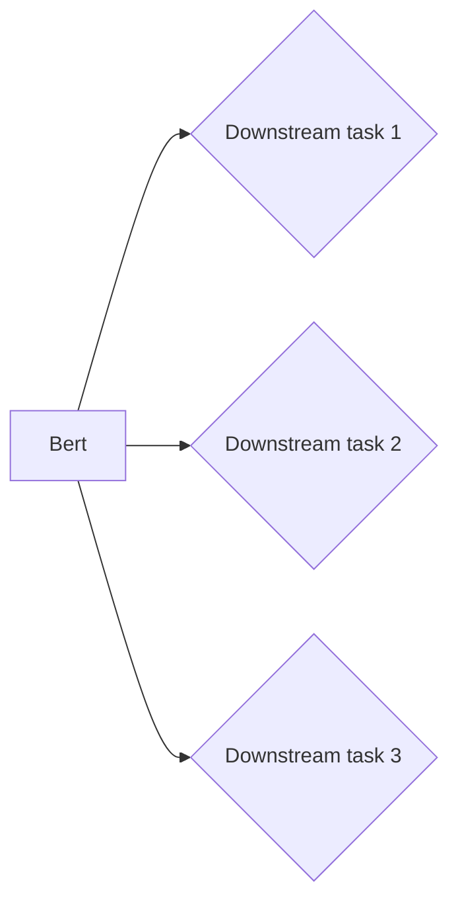

# 构想图解

## 第一版



第一版设计：为三个任务分别设计三个线性层，共用一个Bert模型。进行预训练时预训练仅仅针对三个线性层，每次微调时才能够更改Bert模型。不论是预训练还是微调都需要同时训练三个任务。

同时一个完整流程包括：查看pretrain之后的针对各个任务的效果；进行finetune同时查看针对各个任务的效果。

对于该模型最终pretrain各个效果为：

```
Sentiment classification accuracy: 0.398
Paraphrase detection accuracy: 0.625（此时将所有句子均预测为一个类，失败）
Semantic Textual Similarity correlation: 0.099
```

同时对比之前只有sentiment-classify任务时的效果：

```
Pretraining for SST: Dev Accuracy: 0.390 (0.007)
Finetuning for SST: Dev Accuracy: 0.515 (0.004)
```

### 失误

+ 低级失误：很多，
  + 包括函数（如cat函数,dim=1代表横向拼接）与张量用法错误（主要是shape计算时不匹配）
  + 字典的key写错
  + 计算MSEloss时未能将标签float化
  + 针对任务三pretrain时模型没有任何更新项使得loss.backward报错
  + 用错给定的包装类（TestDataset和Dataset）
+ 中级失误
  + 未能把握pytorch的更新流程（loss.backward()后，所有参数.grad均为0，然而我仍在打印参数梯度，结果自然为None，使得我误以为参数未更新）
  + 对于模型输出output进一步修改（主要是形状的改变），使得计算图失效，模型不更新
  + 训练时每一次模型输出间隔太大（1000步），缺少直观的变化，难以把握当前模型性能
  + 未找到调试的精髓————使用print一级一级向上回溯
+ 高级（模型设计）失误：
  + 针对任务2线性层规划失误，直接从768到1，参数过少，结果模型全部预测为0分类
  + 使用了Bert内部采用的dropout到下游任务模型层。（但不确定是否损害了模型性能）
  + 针对任务2,3的原始的模型规划未沿用。原始的模型和现在的模型基本一致，但是中途由于我以为pytorch不支持模型两次forward()，而改为了把句子对组合成<cls>句子<sep>句子<cls>的新形势，相当于只得到一个Embeddings，和给出的论文的常用方式不符。结果又改正回来。**实际上是未阅读文献的导致的。**
  + 线性层大小、数量增加之后调试用到的训练样本过少，使得调试训练时输出和不改变线性层没有差别，有很大误导性。实际上经过更多训练，模型性能显著高于直接从768投射到1的时候。
  + 针对任务三，做内积后未进行大小sqrt(n)矫正，导致内积过大，损失函数梯度过大过小失效


### 纠正失误后的模型性能

pretrain

```
Sentiment classification accuracy: 0.396
Paraphrase detection accuracy: 0.680
Semantic Textual Similarity correlation: 0.200
```

finetune（iter 6）

```
Sentiment classification accuracy: 0.391
Paraphrase detection accuracy: 0.764
Semantic Textual Similarity correlation: 0.454
```

纠正后的模型为:

+ task 2:两个句子，得到两个Embedding，cat后经过两个线性层再进行二分类，损失函数为CrossEntropy
+ task 3:两个句子，得到两个Embedding，分别经过两个线性层，然后做内积得到similarity score

对比得到结论：

finetune之后task2、task3明显效果显著优于pretrain；然而task1效果却较低；考虑到任务2数据集大小最大，且任务2和任务3相似，说明不同类型任务之间会有干扰，同时修改Bert模型的确比修改线性层效果更好。

## NOTE

实际上还需要Data文件夹与Bert的基础文件夹。
